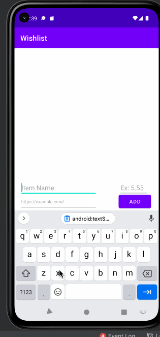

# Android Project 2 - *Wishlist Tracker*

Submitted by: **Saida Ibragimova**

**Wishlist Tracker** is a wishlist app that helps the user keep track of what they want to buy.

Time spent: **14** hours spent in total

## Required Features

The following **required** functionality is completed:

- [X] **User can add an item to their wishlist**
- [X] **User can see their list of items based on previously inputted items**

The following **optional** features are implemented:

- [ ] Wishlist app is 🎨 **customized** 🎨
- [ ] User can delete an item by long pressing on the item
- [ ] User can open an item's URL by clicking on the item

The following **additional** features are implemented:

* [ ] Create a priority flag for items on the shopping list
* [ ] Have a delete icon / clear button to start the list from scratch

## Video Walkthrough

Here's a walkthrough of implemented user stories:

<!-- Replace this with whatever GIF tool you used! -->
GIF created with LiceCap!  
<!-- Recommended tools:
[Kap](https://getkap.co/) for macOS
[ScreenToGif](https://www.screentogif.com/) for Windows
[peek](https://github.com/phw/peek) for Linux. -->

## Notes

Describe any challenges encountered while building the app:

The main challenge was to understand the pipeline of the RecycleView. I took some time to figure out how Adapter is connected to the LayoutView, the MainActivity files, and how each of the Item classes could be integrated into a big picture. Additionally, it took me a while to understand the functionality of wrap_content vs match_parameter parameters in the .xml files.

## License

    Copyright [2022] [Saida Ibragimova]

    Licensed under the Apache License, Version 2.0 (the "License");
    you may not use this file except in compliance with the License.
    You may obtain a copy of the License at

        http://www.apache.org/licenses/LICENSE-2.0

    Unless required by applicable law or agreed to in writing, software
    distributed under the License is distributed on an "AS IS" BASIS,
    WITHOUT WARRANTIES OR CONDITIONS OF ANY KIND, either express or implied.
    See the License for the specific language governing permissions and
    limitations under the License.

